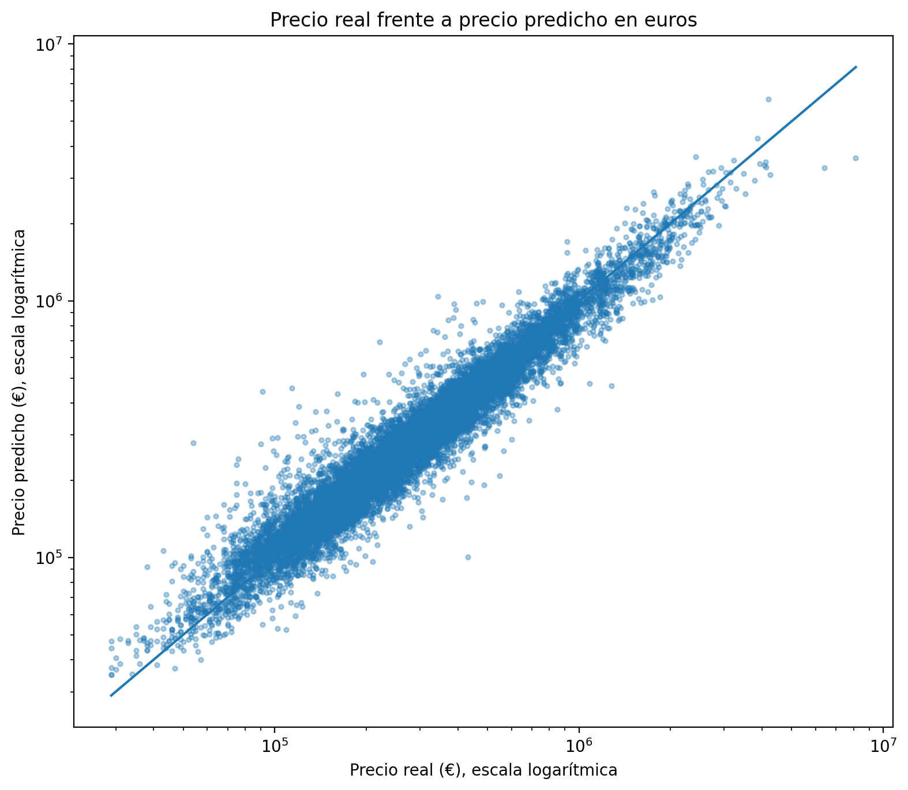
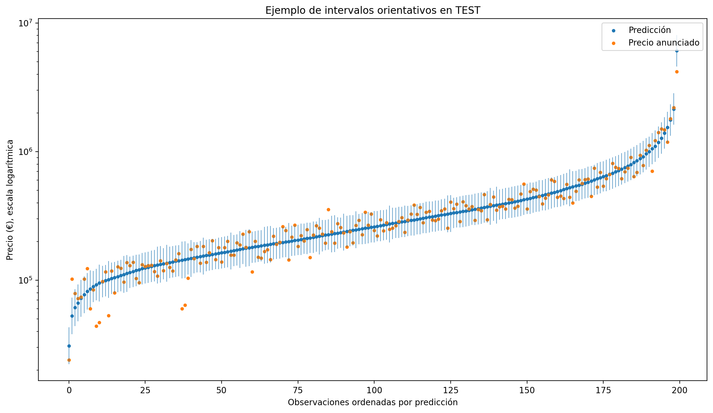
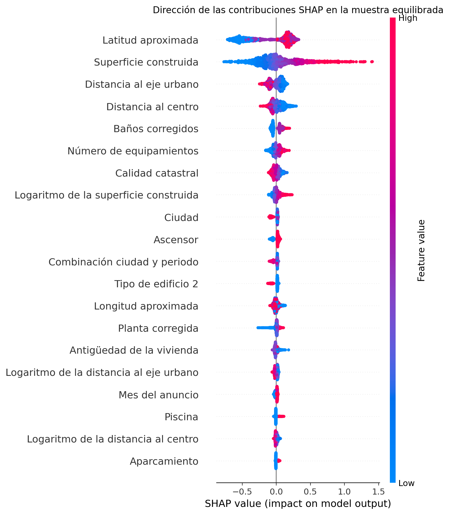
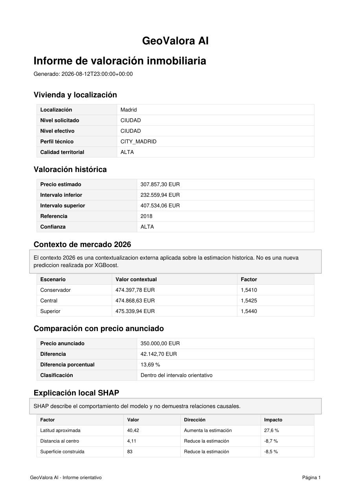

# GeoValora AI

### Explainable and uncertainty-aware real estate valuation in Spain

GeoValora AI is an end-to-end Machine Learning project for residential property valuation in **Madrid, Barcelona and Valencia**.

The project goes beyond producing a single price estimate by combining predictive modeling with **uncertainty quantification, SHAP explainability, territorial context and an interactive Streamlit application**.

---

## Project Highlights

- End-to-end Machine Learning workflow using real-world residential property data from Madrid, Barcelona and Valencia
- XGBoost regression model with **R² = 0.9377** on the held-out TEST partition
- **10.26% median absolute percentage error (MedAPE)** on TEST
- SHAP explainability with stability analysis across cities
- Calibrated prediction intervals achieving **90.17% empirical TEST coverage**
- Territorial and temporal contextualization separated from the frozen predictive model
- Interactive Streamlit application with buyer, investor and scenario-analysis tools
- Automated valuation reports with predictions, uncertainty and local explanations

---

## Problem

Real estate price prediction is not only about estimating a number.

A useful analytical system should also answer:

- How reliable is the prediction?
- Which variables influenced the estimate?
- Is the property similar to observations seen during training?
- How does the estimate compare across geographical contexts?
- What are the limitations of the model?

GeoValora AI was designed around these questions.

---

## Machine Learning Approach

The project follows a structured experimental workflow:

1. Data quality assessment, cleaning and exploratory analysis
2. Feature engineering and leakage prevention
3. Experimental design and baseline modeling
4. Hyperparameter selection and robust validation
5. Final evaluation, error analysis and SHAP explainability
6. Uncertainty calibration and application packaging

The final model is based on **XGBoost** using a frozen feature contract of **52 predictors**.

---

## Final Model Performance

Final evaluation on the held-out TEST partition:

| Metric | Result |
|---|---:|
| R² (log target) | 0.9377 |
| MAE (log target) | 0.1348 |
| RMSE (log target) | 0.1843 |
| MAE | €47,936 |
| RMSE | €97,772 |
| Median Absolute Percentage Error | 10.26% |

The TEST partition was reserved for final evaluation and was not reused for subsequent model-selection decisions.

### Actual vs. Predicted Prices

The figure below compares observed and predicted residential listing prices on the held-out TEST partition.

Both axes represent prices in euros using a logarithmic scale, which makes it easier to visualize model performance across a wide range of property values.

The concentration of observations around the diagonal indicates strong agreement between actual and predicted prices, while larger deviations become more visible at the extremes of the distribution.



---

## Uncertainty

GeoValora AI complements point predictions with calibrated prediction intervals rather than presenting a single estimate with false precision.

The final framework was calibrated to a nominal coverage of **90%** and achieved **90.17% empirical coverage on the held-out TEST partition**.

### Prediction Intervals

The figure below shows a sample of TEST observations ordered by predicted price. Blue points represent model predictions, orange points represent observed listing prices, and vertical ranges represent the associated uncertainty intervals.

Prices are displayed on a logarithmic scale to make the wide range of property values easier to visualize.



---

## Explainability

GeoValora AI uses **SHAP** to explain both global model behavior and individual predictions.

SHAP values identify which features contribute positively or negatively to model output, but they **should not be interpreted as causal effects**.

### Global SHAP Analysis

The summary plot shows both the magnitude and direction of feature contributions across a balanced sample of properties.

The model relies strongly on geographical and structural characteristics, particularly approximate latitude, constructed area and distance-related variables.



---

## GeoValora AI Application

The final project includes a Streamlit application with:

- Property valuation
- Prediction intervals
- Analytical confidence
- Local SHAP explanations
- City / district / neighborhood context
- Scenario comparison
- Buyer analysis
- Investor analysis
- JSON, HTML and PDF reports

The application runtime consumes frozen model artifacts and does not retrain the model during inference.

---

## Example Output

Below is an example of a GeoValora AI valuation report showing the historical estimate, prediction interval, analytical confidence, 2026 contextualization and local SHAP explanation.



---

## Technology Stack

- Python
- pandas
- NumPy
- scikit-learn
- XGBoost
- SHAP
- Matplotlib
- PyArrow
- joblib
- Streamlit
- Jupyter / Google Colab
- Git / GitHub

---

## Portfolio Repository Structure

```text
geovalora-ai-portfolio/
├── images/       Selected visual results
├── notebooks/    Selected portfolio notebooks
├── results/      Aggregated model results
├── src/          Selected reusable Python code
└── README.md

This repository is a **public portfolio version** of the project.

The complete academic repository, datasets and restricted artifacts are not redistributed here.

---

## Data Policy

The underlying project uses historical residential property listing data.

Complete original, cleaned and modeled datasets are **not included in this public repository**.

Only selected code, aggregated results and visualizations are published.

---

## Important Limitations

- The predictive model is based on historical 2018 listing-price data.
- Predictions represent estimated listing prices rather than guaranteed transaction prices.
- Territorial information may be approximate.
- SHAP explanations are not causal.
- Prediction intervals communicate model uncertainty but are not official appraisal intervals.
- GeoValora AI is an analytical prototype and not an official property appraisal service.

---

## Author

**Anastasia García Reziapova**

Master's Final Project  
Data Science, Big Data & Business Analytics
